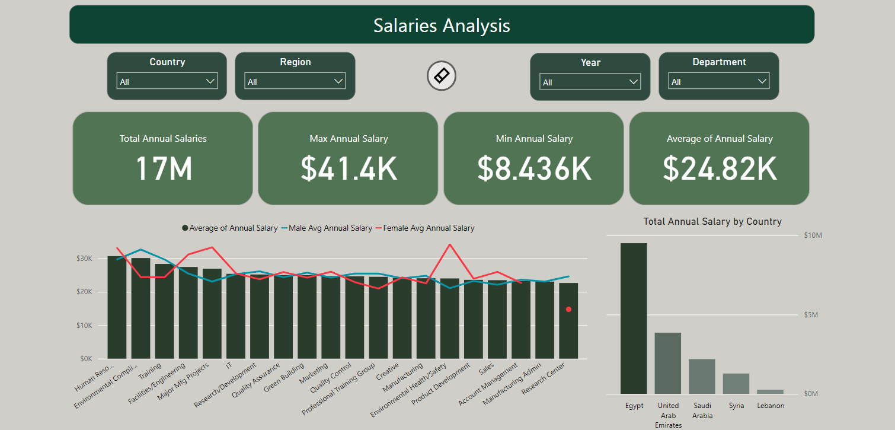
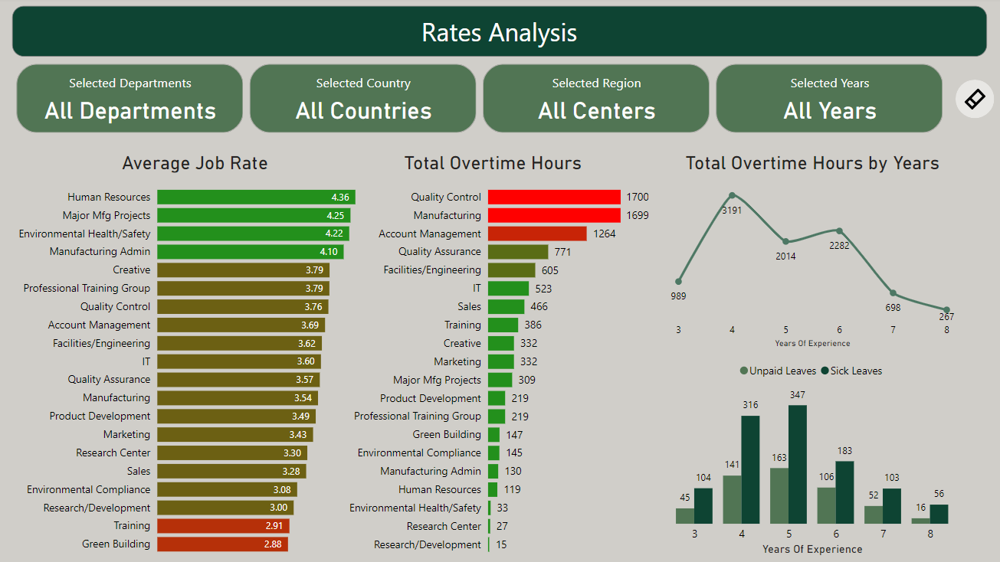
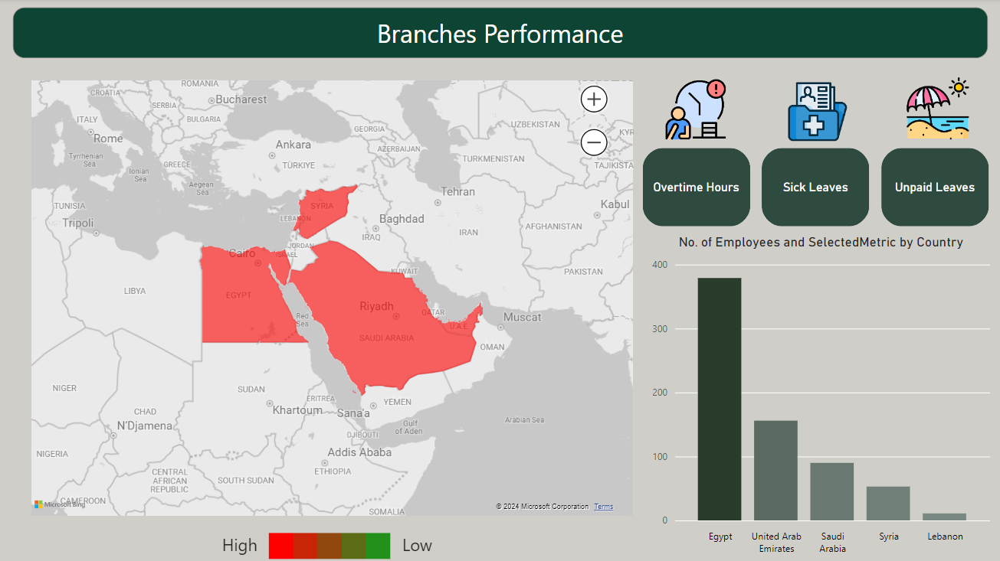
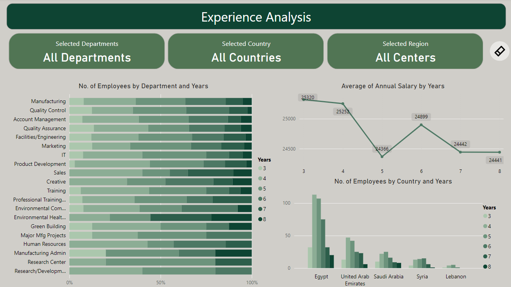

# HR Management Power BI Dashboard

## Project Overview

This Power BI project is designed to assist HR managers in tracking and analyzing key metrics across different departments and countries. The dashboard is structured into multiple pages, each focusing on specific HR aspects:

1. **Salaries** - Tracks salary information on the first page.
2. **Rates and Overtime Patterns** - Analyzes department rates along with overtime patterns on the second page.
3. **Leaves Analysis** - Uses a map chart on the third page to recognize patterns in countries with high metrics for overtime, unpaid leaves, and sick leaves.
4. **Experience Trends** - Measures experience trends on the fourth page to identify countries and departments that rely on specific experience levels.

This project includes interactive features such as slicers, custom tooltips, and an interactive dashboard to enhance data exploration.

## Images

Below is a list of images used within the project.

1. **Salaries**

   
   - **Description:** Salary data visualization on the first page.

2. **Rates**

   

   - **Description:** Rate visualization representing performance metrics.

        - **Rates Tooltip**

        
        - **Description:** Tooltip showing detailed rates data.

4. **Branches**

    
   - **Description:** Overview of different branches.

        - **Branches Tooltip**
            
        - **Description:** Tooltip for branches showing additional data.

        - **Branches filter**
            
        - **Description:** Showcasing the dashboard after Filter

        - **Branches filter 2**
            
        - **Description:** Showcasing the dashboard after    another Filter

5. **Experience**
   
   
   - **Description:** Visualization of experience trends across departments and countries.

## Features
- **Interactive Filters**: Explore the data with dynamic filters and slicers.
- **Advanced Visuals**: Utilize custom visuals for better data representation.

## How to Use
1. Download the `.pbix` files from the repository.
2. Open the files in Power BI Desktop.
3. Interact with the dashboards to explore various insights.